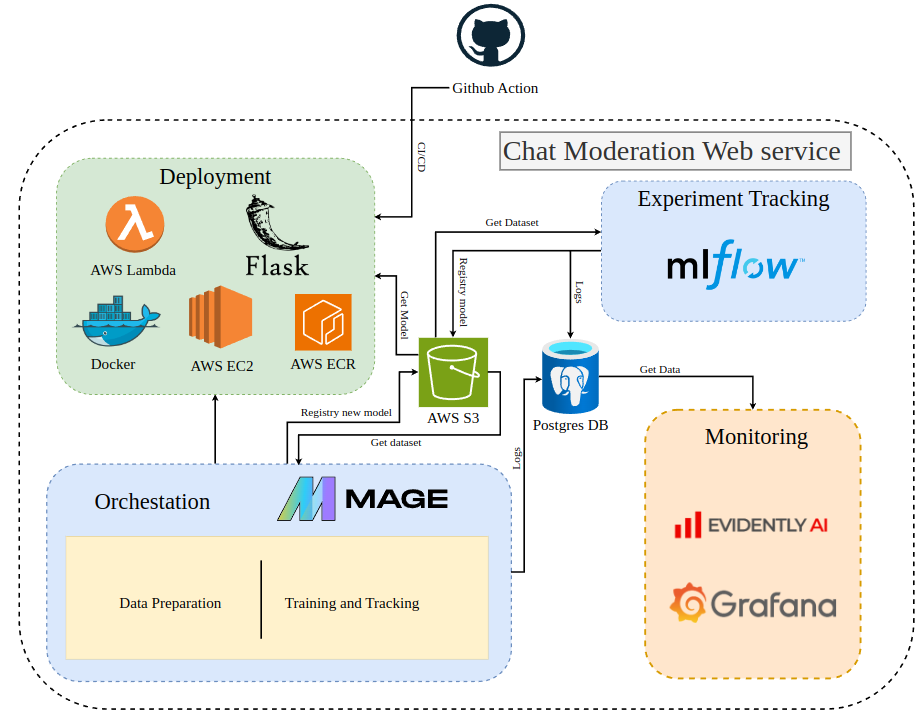
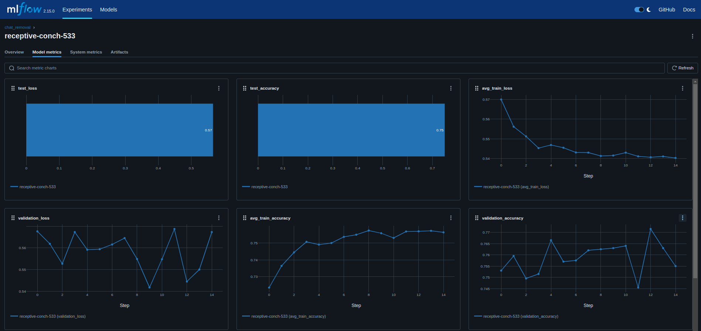
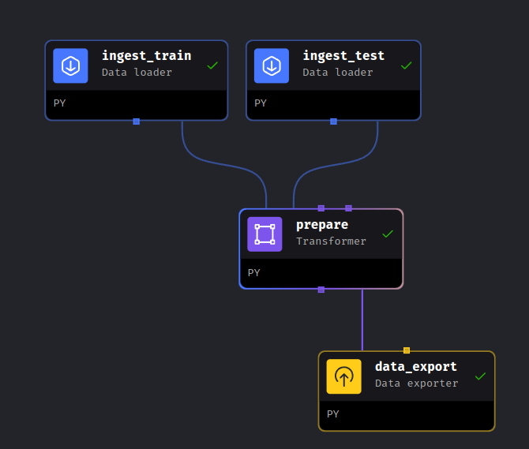
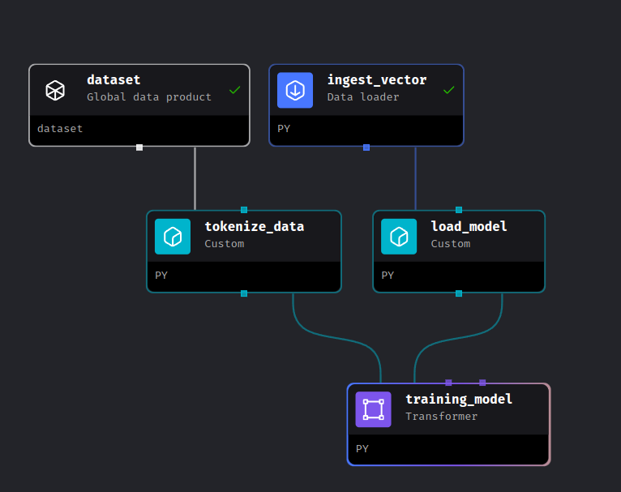

# Chat Moderation ML Project

<div align="center">
  
</div>

## Table of Contents
1. [Introduction](#introduction)
2. [Problem Description](#problem-description)
3. [Solution Approach](#solution-approach)
4. [Dataset](#dataset)
5. [Technologies Used](#technologies-used)
6. [Experiment Tracking and Model Registry](#experiment-tracking-and-model-registry)
7. [Workflow Orchestration](#workflow-orchestration)
8. [Model Deployment](#model-deployment)
9. [Model Monitoring](#model-monitoring)
10. [Reproducibility](#reproducibility)
## Introduction

In this project, we will develop a machine learning model for **chat moderation**. The primary goal is to classify messages as positive or negative, enabling a better user experience by filtering out negative chat content.

## Problem Description

The rise of online platforms has led to an increase in user-generated content, often resulting in negative and harmful comments that can affect user experience. This project aims to provide a **chat moderation solution** by classifying messages into positive or negative categories. The primary goal is to ensure a healthy and friendly environment for users by automatically filtering and moderating content.

- **Why is this important?**  
  Online communities require moderation to maintain a safe environment, and automating this process can save time and reduce the risk of human error.
  
- **What problem does it solve?**  
  This project will automate the moderation process, ensuring timely intervention for negative comments and allowing for a seamless user experience.

## Solution Approach

Our solution will involve the following steps:

1. **Data Collection and Preparation:** Collect and preprocess chat data to build a robust training dataset.
2. **Model Training:** Train a machine learning model to classify messages as positive or negative.
3. **Model Deployment:** Deploy the model as a web service for real-time moderation.
4. **Model Monitoring:** Monitor the performance and accuracy of the model post-deployment.
5. **Model Retraining:** Implement an automated pipeline for retraining the model with new data when necessary.

## Dataset

We will use the [Kaggle Science popular comment removal](https://www.kaggle.com/datasets/areeves87/rscience-popular-comment-removal?resource=download) which contains data labeled as positive and negative based on sentiment analysis of tweets.

### Data Overview

#### About Dataset

**Context**  
In the Age of the Internet, we humans as a species have become increasingly connected with each other. Unfortunately, that's not always a good thing. Sometimes we end up inadvertently connecting with people we'd really rather not talk to at all, and it ruins our day. In fact, trolls abound on the internet, and it's become increasingly difficult to find quality online discussions. Many online publishers simply do not allow commenting because of how easy it is for a few trolls to derail an otherwise illuminating discussion.

But maybe we can fix all that with the power of data science.

**Content**  
The dataset is a CSV of about 30k Reddit comments made in /r/science between Jan 2017 and June 2018. 10k of the comments were removed by moderators; the original text for these comments was recovered using the pushshift.io API. Each comment is a top-level reply to the parent post and has a comment score of 14 or higher.

**Acknowledgements**  
The dataset comes from Google BigQuery, Reddit, and Pushshift.io.

Thanks to Jesper Wrang of removeddit for advising on how to construct the dataset.

Thanks to Jigsaw for hosting the Toxic Comment Classification Kaggle Challenge -- from which I learned a lot about NLP.

Thanks to the participants of said challenge -- I borrow heavily from your results.

**Inspiration**  
- Can we help reduce moderator burnout by automating comment removal?
- What features are most predictive of popular comments getting removed?

## Technologies Used

In this project, we have utilized a combination of powerful technologies to ensure scalability, maintainability, and efficiency:

- **Cloud:** 
  - **AWS S3** for data storage: Storing datasets and model artifacts efficiently.
  - **AWS EC2** for compute resources: Running compute-intensive tasks and hosting web services.
  - **AWS Lambda** for serverless functions: Executing lightweight tasks without managing servers.

- **Experiment Tracking:** 
  - **[MLFlow](https://mlflow.org/):** Tracking experiments, logging parameters, and managing the model lifecycle with ease.

- **Workflow Orchestration:** 
  - **[Mage](https://www.mage.ai/):** Building and managing data pipelines and workflows with a focus on simplicity and scalability.

- **Model Deployment:** 
  - **[Docker](https://www.docker.com/):** Containerizing applications to ensure consistency across different environments.
  - **[AWS ECR](https://aws.amazon.com/ecr/):** Storing Docker images securely and facilitating deployment to AWS services.

- **Monitoring:** 
  - **[Grafana](https://grafana.com/):** Monitoring model performance and visualizing key metrics through interactive dashboards.
  - **[Evidently](https://evidentlyai.com/):** Tracking model drift and performance metrics to ensure model reliability.

- **CI/CD:** 
  - **[GitHub Actions](https://github.com/features/actions):** Automating testing, integration, and deployment processes.

- **Infrastructure as Code (IaC):** 
  - **[Terraform](https://www.terraform.io/):** Provisioning and managing cloud resources using declarative configuration files.

This combination of technologies not only ensures a robust end-to-end machine learning workflow but also enhances collaboration, reproducibility, and scalability.


## Experiment Tracking and Model Registry

### Experiment Tracking with MLFlow

- **Setup:** We used MLFlow to track experiments, log hyperparameters, and record metrics during training. This helped us to keep track of different models and select the best-performing one.
  
- **Components Tracked:**
  - Model accuracy and loss
  - Training and validation datasets
  - Hyperparameters like learning rate, batch size, and epochs

- **Screenshots:**
  
  

### Model Registry

- **Purpose:** The model registry within MLFlow helped us manage different versions of the model, ensuring that only the best models are used in production.
- **Process:** Models were registered after each successful experiment, allowing for easy deployment and rollback if necessary.

## Workflow Orchestration

### Mage for Orchestration

- **Description:** Mage is used to orchestrate the data pipelines and workflow processes involved in the chat moderation project. It simplifies complex workflow creation and management.
- **Key Features:**
  - Supports building pipelines using code, visual interfaces, or notebooks.
  - Provides an easy way to manage dependencies and trigger workflows.
  - Offers scalability to handle large data processing tasks.

#### Pipeline Setup with Mage

Mage allows you to define workflows using a declarative syntax. Here’s an example of how you might set up a pipeline to preprocess data, train a model, and deploy it:

- **Data Preparation Pipeline:**
  
  

- **Model Training and Tracking Pipeline:**
  
  

## Model Deployment

### Deployment Strategy

- **Containerization:** Docker was used to containerize the application, ensuring consistency across environments.
- **Kubernetes:** The containerized application was deployed on Kubernetes for easy scaling and management.
  
### Deployment Process

1. **Containerize the Model:**  
   Using Docker, we created a container that includes the model, along with the necessary environment and dependencies.

   ```dockerfile
      FROM python:3.9

      WORKDIR /app

      COPY requirements.txt /app/

      RUN pip install -r requirements.txt

      COPY . /app

      EXPOSE 9696

      CMD ["gunicorn", "-b", "0.0.0.0:9696", "predict:app"]

   ```

2. **Model Deployment:**

To deploy the containerized application on Lambda, follow these steps:
[Guide for push container to ECR](https://medium.com/@sayalishewale12/complete-guide-to-creating-and-pushing-docker-images-to-amazon-ecr-70b67ac1ab4c)

1. Upload this container to ECR:

    ```bash
      # Build Dockerfile
      docker build -t webservice-model-moderation:v1 .

      # Remember to set up AWS CONFIGURE
      aws ecr create-repository --repository-name webservice-model-moderation:v1
    ```

2. Create a Lambda service using container in ECR

### Deployment Workflow

1. **Local Testing**: Verify the model locally using Docker.
2. **Push to Registry**: Push the Docker image to a container registry.
3. **Deploy to Kubernetes**: Use Kubernetes to deploy the application.
4. **Scale and Manage**: Adjust replicas and resources as needed using Kubernetes.

## Model Monitoring

### Grafana for Monitoring

**Description**: Grafana is used for monitoring the performance of the deployed model. It provides real-time insights into the model's predictions, resource utilization, and alerts for any anomalies.

**Key Features**:
- Interactive dashboards that visualize key metrics and logs.
- Integration with Prometheus, Elasticsearch, and other data sources for comprehensive monitoring.
- Custom alerting to notify the team about performance issues or data drift.

## Alert System
An alert system was integrated with Slack to notify the team in case of data drift or performance issues.

```python
def send_alert(message):
    # Send alert to Slack
    url = "https://slack.com/api/chat.postMessage"
    headers = {"Authorization": f"Bearer {SLACK_TOKEN}"}
    data = {"channel": "#alerts", "text": message}
    response = requests.post(url, headers=headers, json=data)
    if response.status_code != 200:
        print("Failed to send alert to Slack.")
```

## Reproducibility

Ensuring that the project is reproducible was a key focus. We followed best practices to make the code easy to run for anyone who wants to reproduce our results.

### Steps for Reproduction

1. **Clone the Repository:**

    ```bash
    git clone https://github.com/your-repo/chat-moderation.git
    cd chat-moderation
    ```

2. **Deploy Mlflow (Tracking experiment):**

  - Follow this document or Youtube video:

  - Youtube: [MLOps Zoomcamp 2.6 - MLflow in practice](https://www.youtube.com/watch?v=1ykg4YmbFVA&list=PL3MmuxUbc_hIUISrluw_A7wDSmfOhErJK&index=14&t=1383s). By DataTalksClub

  - Document: [Mlflow set up on AWS](../aws_setup/mlflow_on_aws.md)
    

3. **Make Baseline:**

  Run baseline code to have the init model and explore about data

    ```bash
      cd baseline

      conda create -n chat python=3.8 -y
      conda activate chat
      pip install -r requirements.txt
    ```

  Run base baseline_model_chat_removal.ipynb notebook file.

  - Download data
  - Explore Data
  - Preprocess Data
  - Make Train, Val, Test
  - Select Model
  - Hyper Paramater
  - Set up AWS Configure
  - Tracking experiment with Mlflow
  - Using Evidently to make Report Data and Model

    
4. **Set up Mage (Orchestation):**

5. **Set up Grafana and Evident (Monitoring):**

  Not implement

6. **Set up CI/CD and Deploy Webservice:**

  Not implement

### Code Formatter and Linter

  Not implement

### Makefile

  Not implement
